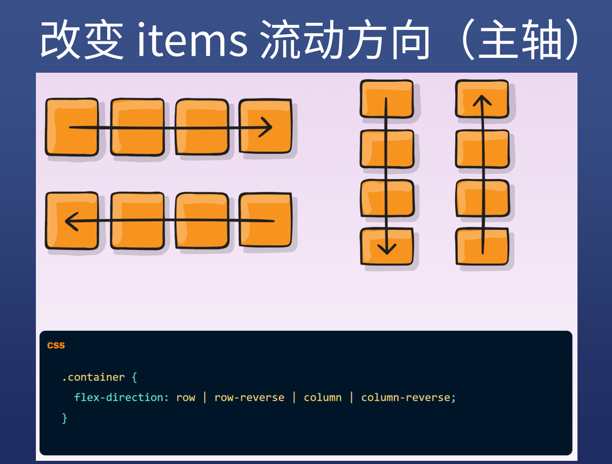
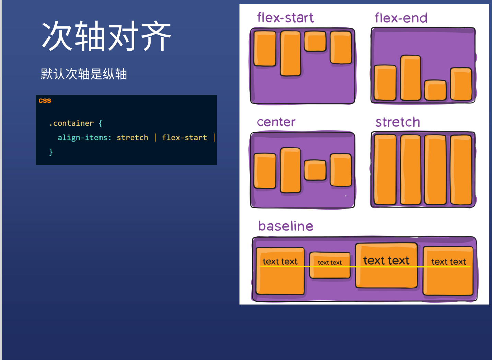
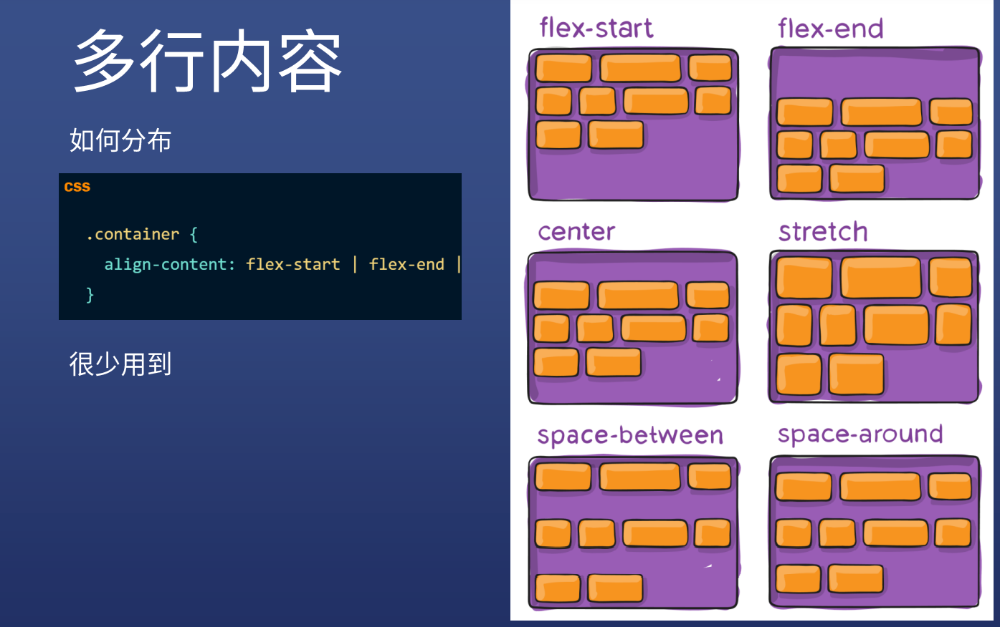
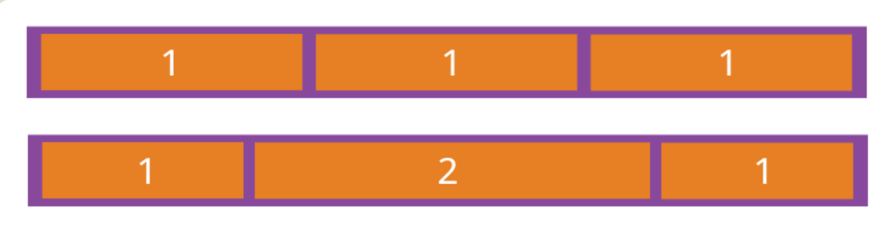
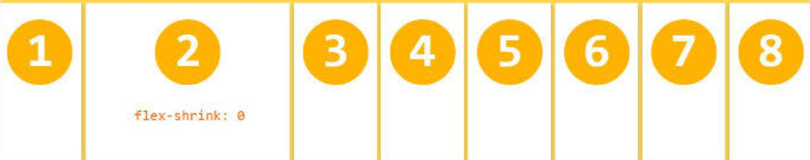

# flex布局
> Flex 是 Flexible Box 的缩写，意为"弹性布局"，用来为盒状模型提供最大的灵活性。
任何一个容器都可以指定为 Flex 布局。

## 1.先将元素变成flex布局
```
container--容器
items--项目

.container {
  display:flex;
  display:inline-flex;
  --先将元素变成flex布局
}
```
## 2.容器属性
> flex-direction: row / column / row-reverse / column-reverse;  --改变items流动方向(主轴)
```
row（默认值）：主轴为水平方向，起点在左端。
row-reverse：主轴为水平方向，起点在右端。
column：主轴为垂直方向，起点在上沿。
column-reverse：主轴为垂直方向，起点在下沿。
```



> flex-wrap: wrap(折行) / nowrap(不折行)/ wrap-reverse(第一行在下方) ; 
 
  
> justify-content: flex-start / flex-end / center / space-between /   space-around / space-evenly /;--主轴对齐方式 
```
flex-start（默认值）：左对齐
flex-end：右对齐
center： 居中
space-between：两端对齐，项目之间的间隔都相等。
space-around：每个项目两侧的间隔相等。所以，项目之间的间隔比项目与边框的间隔大一倍。 
```


> align-items: flex-start / flex-end / center / space-between / space-around / stretch / baseline /;  --次轴对齐方式
```
flex-start：次轴的起点对齐。
flex-end：次轴的终点对齐。
center：次轴的中点对齐。
baseline: 项目的第一行文字的基线对齐。
stretch（默认值）：如果项目未设置高度或设为auto，将占满整个容器的高度。
```



> align-content: flex-start / flex-end / center / space-between / space-around /; 多行内容 --属性定义了多根轴线的对齐方式。如果项目只有一根轴线，该属性不起作用。 


> flex-direction和flex-wrap两个属性经常会一起使用，所以有缩写属性flex-flow。这个缩写属性接受两个属性的值，两个值中间以空格隔开  
```
.container{
  display:flex;
  flex-flow:row-reverse wrap;
}  
```
## 3.items属性
1. 可在items上加 'order' 属性定义项目的排列顺序。数值越小，排列越靠前，默认为0。
```
.item { 
  order: <integer>/* default 0 */;
}
```
2. flex-grow: 属性定义项目的放大比例，默认为0，即如果存在剩余空间，也不放大.  
如果所有项目的flex-grow属性都为1，则它们将等分剩余空间（如果有的话）各占一份。如果一个项目的flex-grow属性为2，其他项目都为1，则前者占据的剩余空间将比其他项多一倍。  
```
.item {
  flex-grow: <number>; /* default 0 */
}
```


3. flex-shrink:属性定义了项目的缩小比例， 默认值为1，即如果空间不足，该项目将缩小. 
 
如果所有项目的flex-shrink属性都为1，当空间不足时，都将等比例缩小。如果一个项目的flex-shrink属性为0，其他项目都为1，则空间不足时，前者不缩小。
负值对该属性无效。 
```
.item {
  flex-shrink: <number>; /* default 1 */
}
```
4. flex-basis属性定义了在分配多余空间之前，项目占据的主轴空间（main size）。浏览器根据这个属性，计算主轴是否有多余空间。它的默认值为auto，即项目的本来大小。  


5. flex属性:flex属性是flex-grow, flex-shrink 和 flex-basis的简写，默认值为0 1 auto。后两个属性可选。  
```
.item {
  flex: none |  <flex-grow> <flex-shrink> || <flex-basis> ;
}
```
6. align-self属性  
align-self属性允许单个项目有与其他项目不一样的对齐方式，可覆盖align-items属性。默认值为auto，表示继承父元素的align-items属性，如果没有父元素，则等同于stretch。
```
item {
  align-self: auto | flex-start | flex-end | center | baseline | stretch;
}
```
#  重点
* display:flex
* flex-direction:row/column
* flex-wrap:wrap/nowrap
* justify-content:center/space-between
* align-items:center;


 


