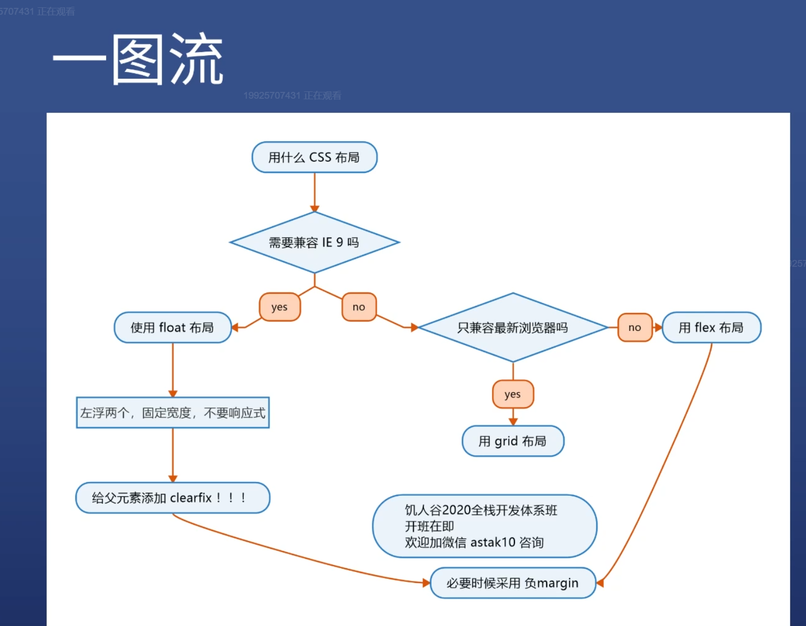

# float 布局

## 步骤
1. 子元素加float:width 和 width
2. 在父级添加class,再添加伪元素和样式后可包裹住浮动元素.
3. 可预留一些空间或最后一个不加width
4. 不需要做响应式，因手机上没IE
5. ie6/7上有双倍margin bug，解决办法有：1.可把值减半 2. 加display：inline-block 3. _margin-left:;
```
父级包裹浮动元素
.clearfix::after{
  content: '';
  display: block;
  clear: both;
}
```
## 不同布局
四栏布局
三栏布局
[代码与预览链接](http://js.jirengu.com/marenafayu/57/edit)


# flex布局
> Flex 是 Flexible Box 的缩写，意为"弹性布局"，用来为盒状模型提供最大的灵活性。
任何一个容器都可以指定为 Flex 布局。  

预览链接[flex预览](http://js.jirengu.com/hucisekofa/3/edit)


## 经验
* 永远不要width 与 height 写死
* 使用min-width/height  max-width/height
* flex 和margin-xxx:auto;配合使用有意外的效果

### 前端戒律
1. 必须给设计稿.没有设计稿就自己画,老板同意再写代码.
2. 没设计稿,不做!
3. 设计稿下载画图软件
